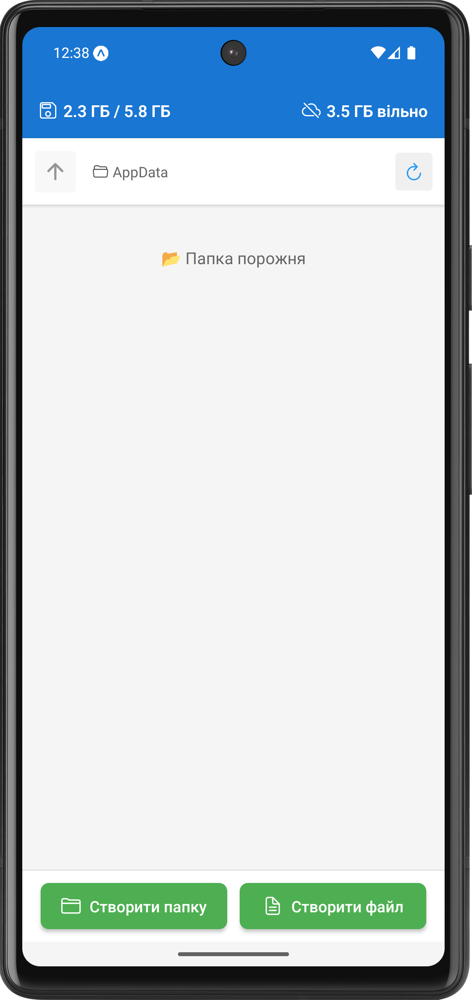
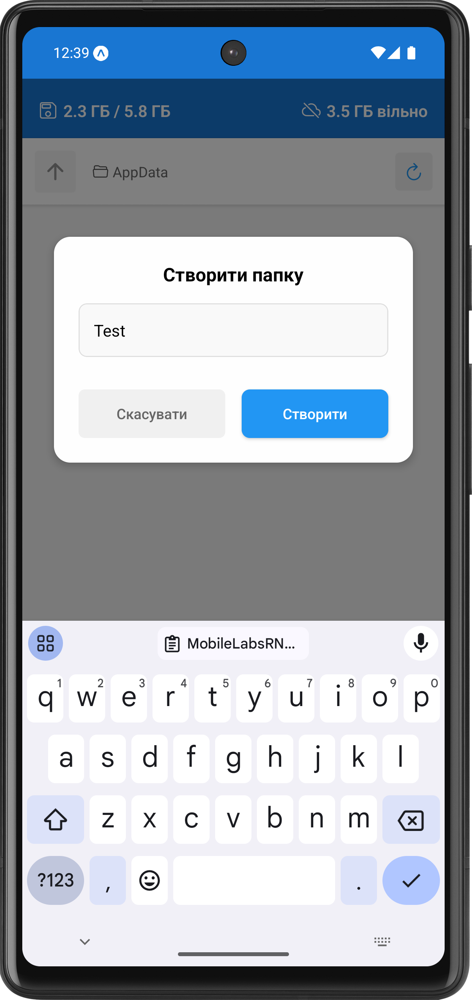
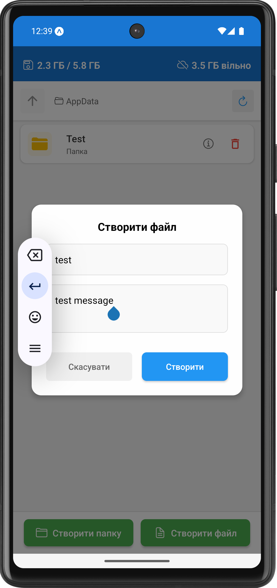
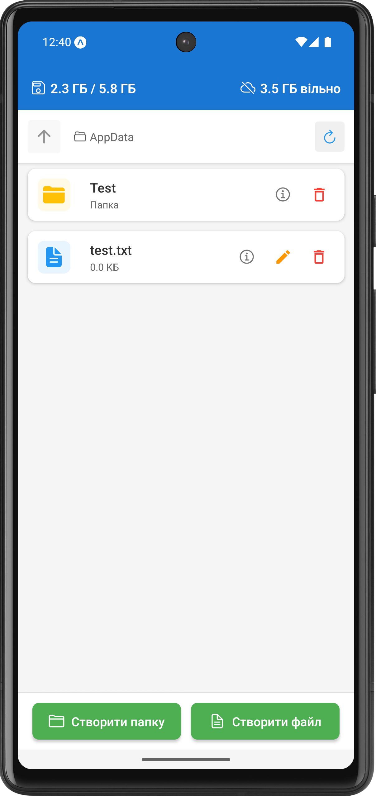
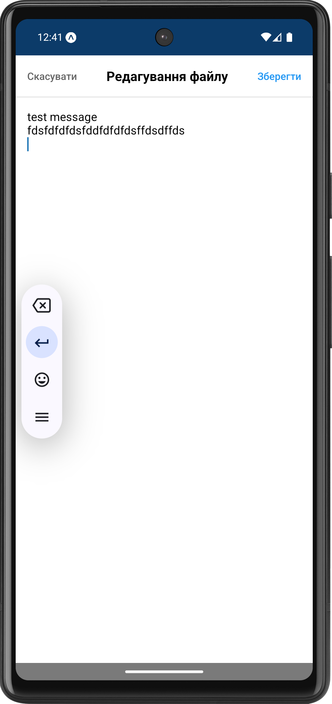
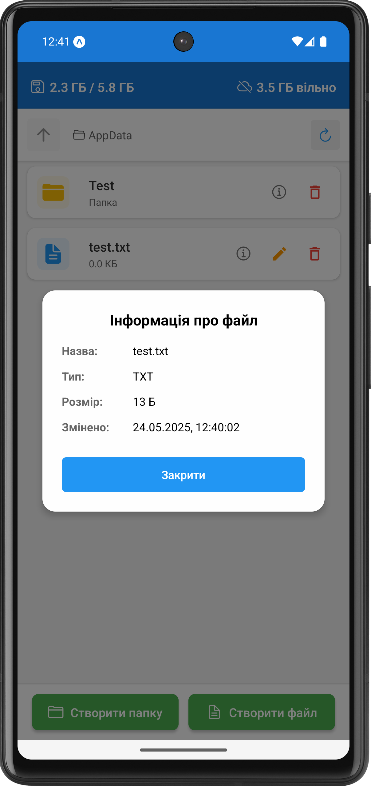
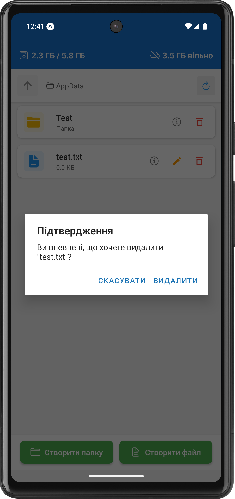

# Лабораторна робота №5

## Інструкція по запуску

1. Клонувати репозиторій:
   ```bash
   git clone https://github.com/ipz234kbb1/MobileLabsRN2025.git
   cd MobileLabsRN2025
   git checkout Lab5
   ```

2. Встановити залежності:
   ```bash
   npm install
   ```

3. Запустити проект:
   ```bash
   npx expo start
   ```

4. Для запуску на емуляторі або фізичному пристрої:
   - Натисніть `a` для запуску на емуляторі Android
   - Натисніть `i` для запуску на емуляторі iOS
   - Відскануйте QR-код в Expo Go на фізичному пристрої

## Скріншоти

### Головний екран


### Створення папки


### Створення файлу


### Після створення елементів


### Редагування файлу


### Інформація про файл


### Видалення

