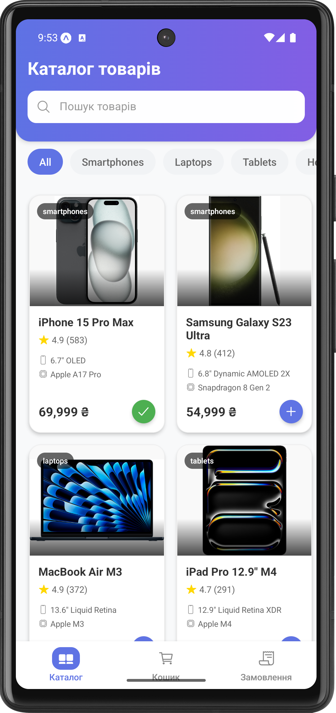
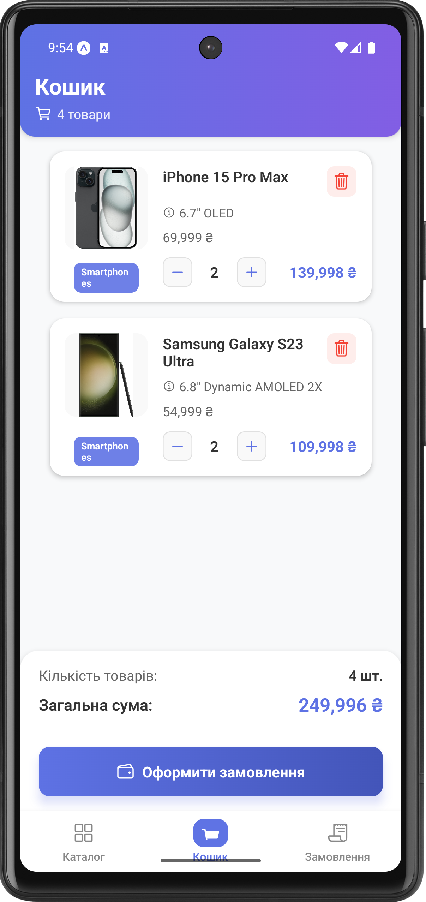
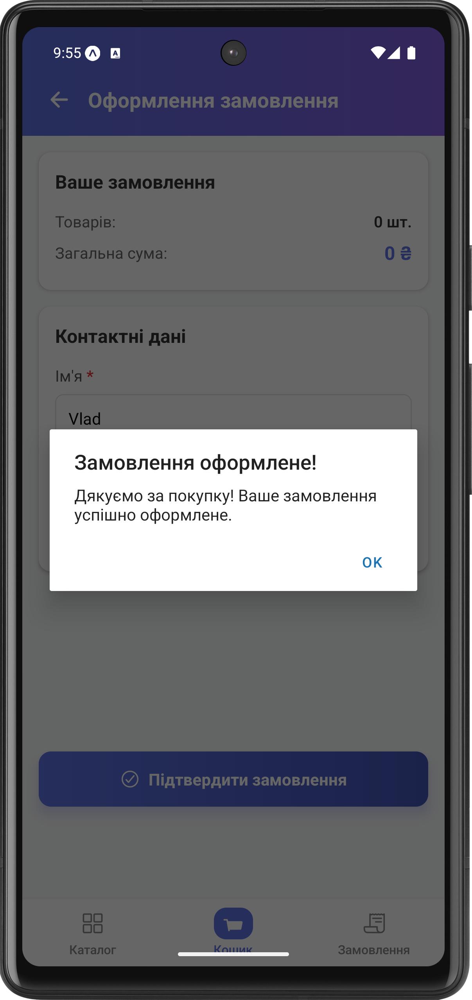
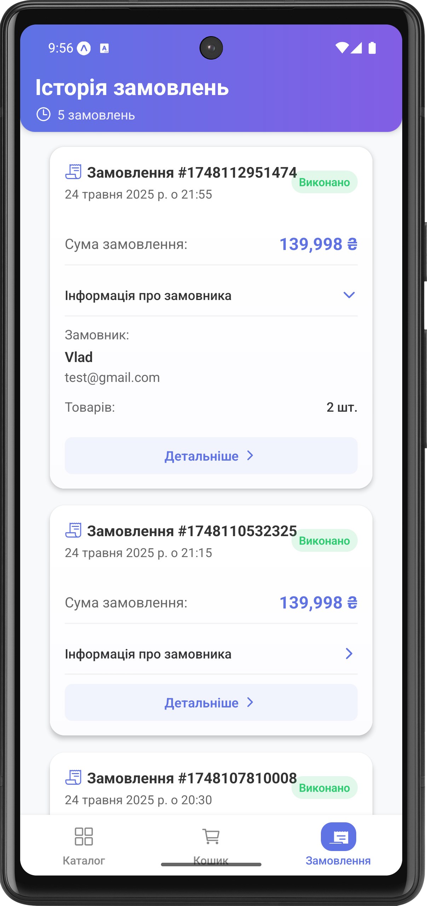
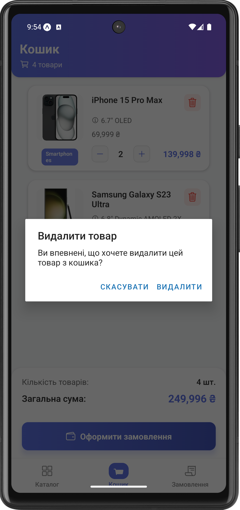
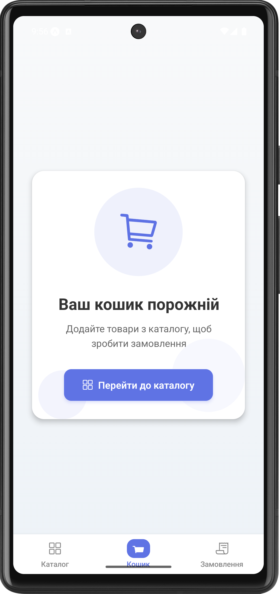

# Mobile App for Order Management

## Опис проекту

Цей додаток призначений для керування замовленнями. Він дозволяє переглядати каталог товарів, створювати нові замовлення, переглядати історію замовлень та керувати поточними замовленнями.

## Встановлення та запуск

1. Переконайтеся, що у вас встановлений Node.js та npm
2. Встановіть залежності проекту:
   ```bash
   npm install
   ```
3. Запустіть додаток:
   ```bash
   npx expo start
   ```
4. Відскануйте QR-код за допомогою додатку Expo Go на вашому смартфоні або запустіть на емуляторі.

## Скріншоти додатку

### Каталог товарів


### Створення замовлення


### Підтвердження замовлення


### Виконані замовлення


### Історія замовлень


### Видалення замовлення


### Порожній стан


## Історія комітів

- `feat: initialize project with basic navigation`
- `feat: add catalog screen with product list`
- `feat: implement order creation functionality`
- `feat: add order history screen`
- `feat: add order completion flow`
- `feat: implement order deletion`
- `style: update UI components and styling`
- `docs: add README with screenshots and setup instructions`

## Технології

- React Native
- Expo
- React Navigation
- Redux (або Context API, залежно від реалізації)
- React Native Paper (або інша бібліотека UI компонентів)

## Автор

[Ваше ім'я]
