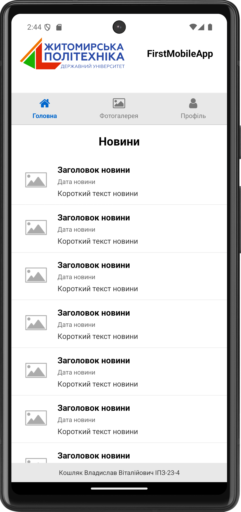
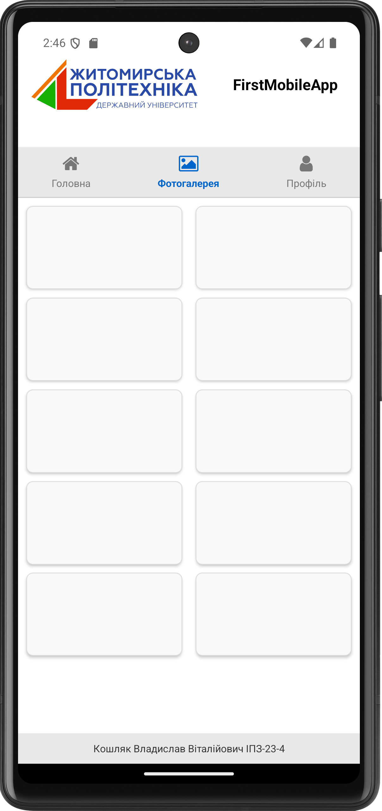

# Лабораторна робота №1
## Інструкція по запуску

1. **Встановлення залежностей:**
   ```bash
   npm install
   ```

2. **Запуск на емуляторі Android:**
   ```bash
   npx expo start --android
   ```

3. **Запуск на емуляторі iOS:**
   ```bash
   npx expo start --ios
   ```

4. **Запуск в режимі розробки:**
   ```bash
   npx expo start
   ```

## Скріншоти екранів

### Екран "Новини"


### Екран "Фотогалерея"


### Екран "Реєстрація"


